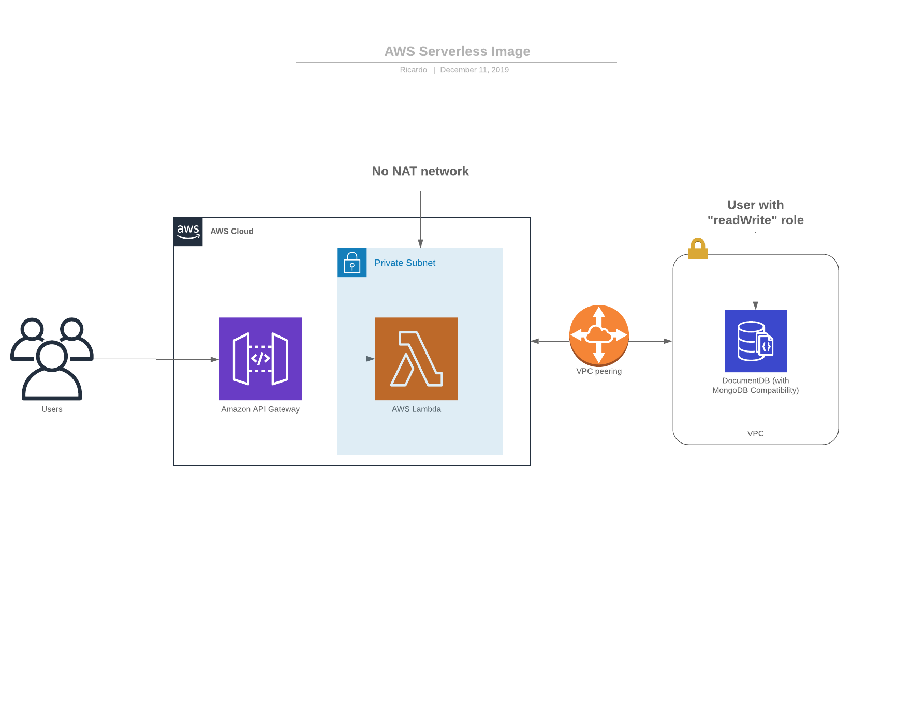

# Architecture

##Production endpoint: 
https://uz6d34jo34.execute-api.eu-central-1.amazonaws.com/production

## REST API:
* GET /url?hash=${hash} -> Get url based on hash
* POST /url { "url": "string" }-> create/update a shortened url based on uri
* GET /url/stats -> Get all shortened urls created for a uri

## TODOs:
* Set-up network configurations: VPC, private subnets, permissions
* Blacklist all incoming requests to database besides those which come from VPC peering
* Cron configuration is not working (created manually)
